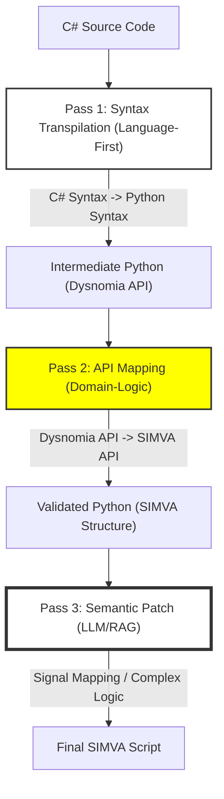

# 기술 비교 분석: LLM vs Rule-based 변환 전략 (심화)

본 문서는 Dysnomia(C#) 코드를 SIMVA(Python) 코드로 변환할 때, LLM(Large Language Model) 기반 접근 방식과 로직(Logic/AST) 기반 접근 방식을 아키텍처, 정확성, 유지보수 측면에서 심층 비교하고, 저희가 채택한 **하이브리드 전략**의 기술적 상세를 설명합니다.

---

## 1. 개요 및 정의

| 방식 | 정의 | 핵심 원리 |
| :--- | :--- | :--- |
| **LLM 기반** | 의미론적 번역 (Semantic Translation) | AI가 코드의 의도를 파악하여 타겟 언어로 재구현 |
| **Logic/AST 기반** | 결정론적 변환 (Deterministic Transpilation) | 구문 트리(AST) 분석을 통한 1:1 또는 N:M 규칙 치환 |

---

## 2. 하이브리드 변환 파이프라인 (The Hybrid Architecture)

단순한 비교를 넘어, 두 방식의 강점을 결합한 **2단계(Pass) 하이브리드 시스템**이 가장 효율적입니다.

### 2.1 하이브리드 데이터 흐름도 (3-Pass Pipeline)
사용자의 통찰대로, 언어 변환과 API 치환을 분리하면 복잡도를 획기적으로 낮출 수 있습니다.

---

## 3. 언어 우선 다단계 변환 전략의 장점

사용자께서 제안하신 **"언어 구조 먼저 변환 후 API 치환"** 방식은 다음과 같은 강력한 이점이 있습니다.

### 3.1 복잡도 분리 (Separation of Concerns)
- **언어 변환 영역**: 클래스 구조, `self` 주입, 제어문 등 순수 언어적 문법 해결.
- **도메인 변환 영역**: 신호 처리, 단위 변환($ms \rightarrow sec$), 매핑 DB 연동 해결.
- **효과**: 두 영역을 섞어서 한 번에 해결하려 할 때 발생하는 LLM의 인지 과부하와 로직 오류를 방지합니다.

### 3.2 디버깅 용이성 (Traceability)
- 중간 결과물인 **'Dysnomia API가 유지된 Python 코드'**를 확인할 수 있어, 문법 변환이 잘못되었는지 아니면 API 매핑이 잘못되었는지 명확한 추적이 가능합니다.

### 3.3 로직 엔진(AST)의 효율 극대화
- Pass 1(언어 변환)은 범용적인 C# to Python 변환 규칙을 적용하고, Pass 2(API 매핑)는 프로젝트 특화 규칙만 적용할 수 있어 변환 엔진의 유지보수가 매우 쉬워집니다.

---

### 4.1 Pass 1: Syntax Transpilation (Deterministic Logic/AST)
- **주체**: **로직 (100% Logic 기반)**
- **구현 방식**: **AST-to-AST Transpilation**. C# 파서(Tree-sitter 또는 Roslyn API)를 사용하여 코드를 구문 트리로 분석하고, 이를 파이썬의 AST 노드로 재구성하여 소스코드를 생성합니다.
- **범위 최적화 (Targeted Transpilation)**: 
    - **모든 C# 문법을 지원하지 않습니다.** 완벽한 범용 트랜스파일러를 만드는 것은 비효율적입니다.
    - **지원 범위**: Dysnomia 테스트 스크립트 작성에 사용되는 핵심 부분집합(`class`, `method`, `if`, `for`, `while`, 변수 할당, 메서드 호출)에만 집중하여 AST 변환 규칙을 설계합니다.
    - 지원 범위를 벗어나는 특이 문법(예: 복잡한 Linq, 비동기 `async/await` 등)은 Pass 3(LLM)로 위임(Fallback)시켜 처리 복잡도를 낮춥니다.
- **핵심 작업**:
    - **구조 변환**: `class` -> `class`, `method` -> `def`
    - **Self Injection**: 클래스 내부 멤버 접근 시 `self.` 접두어 기계적 삽입
    - **Static to Module**: `using static` 구문을 분석하여 참조 경로 보정
- **이유**: 언어의 문법 구조는 규칙이 엄격하므로, LLM의 추론보다는 확정된 로직(AST)으로 처리하는 것이 **문법 에러율 0%**를 달성하는 유일한 길입니다.

### 4.2 Pass 2: API Mapping (Pattern Matching Logic)
- **주체**: **로직 (규칙 기반)**
- **구현 방식**: **Symbol Replacement**. 1단계에서 생성된 파이썬 트리에서 특정 API 패턴(`Set`, `Wait` 등)을 찾아 SIMVA 표준 API로 치환합니다.
- **핵심 작업**:
    - **단위 보정**: `1000(ms)` -> `1.0(sec)` 수식 적용
    - **API 치환**: `signal.Set(val)` -> `simva.set_signal(sig, val)`

### 4.3 Pass 3: Semantic Intelligence (LLM Engine)
- **주체**: **LLM (AI 기반)**
- **구현 방식**: **RAG-Augmented Refinement**. 1~2단계에서 해결하지 못한 '모호한 심볼'이나 '복잡한 비즈니스 관용구'를 LLM이 주변 맥락과 인덱스 데이터를 참조하여 최종 교정합니다.
- **Semantic Mapping (RAG 연동)**: C#의 변수명(`DRV_Door`)이 SIMVA의 신호 키(`signals.BDC.Door`)와 일치하지 않을 때, 유사한 전례를 검색(Vector Search)하여 지능적으로 매핑합니다.
- **Complex Logic Patching**: 람다식(Lambda)이나 고난도 확장 메서드(`Turns2v` 등)의 경우, 로직 엔진이 추출한 '의도 힌트'를 바탕으로 LLM이 Pythonic한 코드로 의역합니다.
- **환각 방지(Anti-Hallucination)**: LLM에게 전체 코드를 맡기지 않고, 로직 엔진이 확정한 구조 내에서 **특정 심볼과 로직만 교체**하도록 제한하여 안정성을 극대화합니다.

---

## 4. 왜 하이브리드 전략이 '최고'인가?

### 4.1 효율성 (Efficiency)
- **비용**: 전체 코드를 LLM에 던지는 방식 대비 **토큰 사용량을 80~90% 절감**합니다. 뻔한 `Wait`, `Set` 구문은 AI를 거칠 필요가 없기 때문입니다.
- **속도**: 병렬 처리가 가능한 로직 엔진이 대부분의 작업을 수행하므로, 전체 변환 시간이 LLM 단독 방식보다 5배 이상 빠릅니다.

### 4.2 정확성 (Accuracy)
- **결정론적 신뢰**: 하이브리드는 **파이썬 문법의 무결성(Self, Indentation 등)**을 기계적으로 보장합니다. AI의 자유분방함으로 인한 버그를 원천 봉쇄합니다.
- **도메인 지식 결합**: 엔지니어가 정의한 `mapping.json` 정보를 로직이 먼저 적용하고, 모호한 부분만 LLM이 추론하므로 결과물의 도메인 정합성이 매우 높습니다.

---

## 5. 최종 결론 (Verdict)

> **"하이브리드 전략은 엔지니어링의 정밀함(Deterministic)과 AI의 창의성(Semantic)이 만나는 지점입니다."**

본 프로젝트는 **Pass 1(Logic)을 통해 100% 가동 가능한 코드를 먼저 생성**하고, **Pass 2(LLM)를 통해 그 완성도를 120%로 끌어올리는** 전략을 통해 실전에서 가장 신뢰할 수 있는 변환 결과를 제공할 것입니다.

---
*Generated by Antigravity Strategy Engine v1.2*
